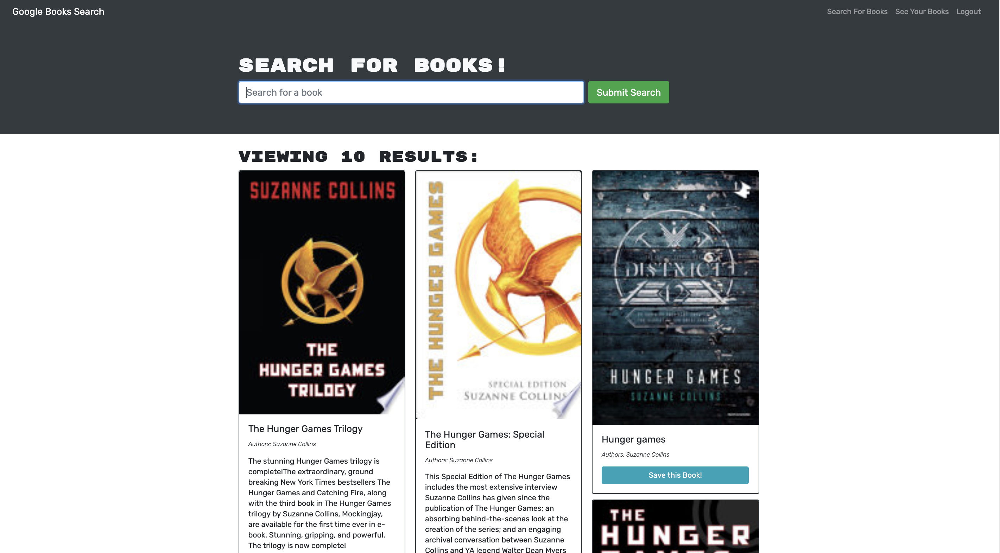
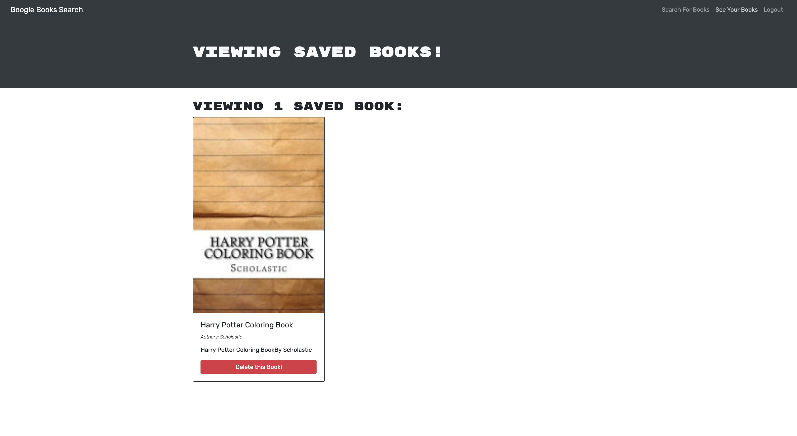

# Google_Book_Search

## Description :

This is a MERN stack book search engine uses MongoDB, Express.js, React.js, and Node.js it also uses the graphQL instead of the more traditional RESTful API to query from the MongoDB. With help of MongoDB Atlas for use of a database that can connect successfully with Graphql.

## Table of Contents

[Installation](https://github.com/ilelandhayes/Google_Book_Search#Installation)

[Usage Of](https://github.com/ilelandhayes/Google_Book_Search#Usage-Of)

[How to Contribute](https://github.com/ilelandhayes/Google_Book_Search#How-to-Contribute)

[Screen Shots](https://github.com/ilelandhayes/Google_Book_Search#Screen-Shots)

[License](https://github.com/ilelandhayes/Google_Book_Search#License)

[Questions](https://github.com/ilelandhayes/Google_Book_Search#Questions)

## Technologies :

- MongoDB
- MongoDB Atlas
- Mongoose
- Express.js
- React.js
- Node.js
- Javascript
- Bootstrap
- GraphQL
- Bcrypt
- Apollo Server

## Installation :

To use the application just run:

    'npm install'

in your terminal

## Usage Of :

Users need to sign up to save their favorite books to their book list and search for books to add to their saved book list or they can delete those books they read.

## Screen Shots :

## How to Contribute :

Any contributions are welcome!

## License :

This repository is released under the license of: [MIT](https://opensource.org/licenses/MIT)

## Questions :

If have any questions about this application feel free to contact me:

Github: [ilelandhayes](https://github.com/ilelandhayes)
